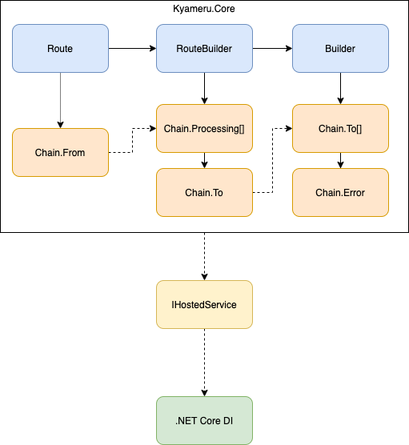
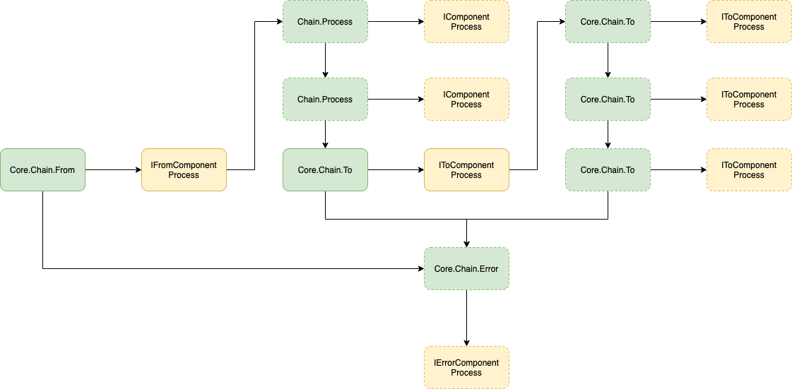

# Kyameru
[](https://github.com/djsuperchief/Kyameru/actions/workflows/build.yml)
[](https://coveralls.io/github/djsuperchief/Kyameru?branch=main)


[](https://opensource.org/licenses/MIT)

## About


Kyameru is a processing engine built with heavy inspiration from Apache Camel.
It is currently in very Alpha stage and contains very few components but more will be added over the coming weeks and months.

## Basic Overview
### Architecture



#### Structure
Kyameru is built on the Chain Of Responsibility pattern. It is built up using the three main construction objects:

1. Route
1. RouteBuilder
1. Builder

Each of the objects above are instantiated in the order specified. Route provides the start of the construction by allowing the definition of a From component. This returns a RouteBuilder object allowing you to add Processing components, add headers or a number of other tasks related to message processing.
The To component is also created here which in turn returns the final Builder object which allows you to add more To components for final processing and an Error component to handle any chain errors.

The Builder component is responsible for injection into the DI container of .NET Core (which is in turn responsible for resolving ILogger instances) and creates an IHosted service for what is known as a Route.

### Workflow


The workflow is fairly simple. Everything starts at the From component. This raises an OnAction event which is picked up by the From chain object that then starts the process off. The Routable message is then passed from component to component until it reaches the last To component in the chain.
What is important is each of the declared components sit within a core Chain object responsible for handling logging, errors and passing execution to injected components during the build.

If at any point the Routable message is deemed to be in error, all processing stops and the only component that continues to process is an Error component that is entirely optional.

#### FTP Example
For instance an FTP download will download a file to a temporary location to be processed. Whilst it can assume some sort of processing on the data of that file will happen it is not known what the end state of the file will be. The FTP component will clean up after itself but it is up to the engineer to decide if any processing failed on the file, what should they do with the temporary file downloaded? Should they move it to an error folder? As far as the FTP component is concerned, its job was to download the file, delete the source and raise the internal message for processing.

## Basic Syntax
### URI Format

As stated before, Kyameru is inspired by Apache Camel and the URI format of injecting components seemed like a sensible approach as it is highly descriptive and a format we have been using for decades. The Uri is split into several parts:

* Scheme = Kyameru component
* Path = Kyameru "target" header
* Query = Kyameru headers

An example of this (file component)

```
Kyameru.Route.From("file:///C:/Test?Notifications=Created&SubDirectories=true&Filter=*.*)
.To("file:///C:/backup?Action=Move)
.Build(services);
```

The above example is very simple but you can see from the syntax that the From construction that:

* Scheme is file -> this intializes the from component Kyameru.Component.File
* Path is C:/Test -> this sets the component header "Target" to C:/Test
* Query -> Adds the headers Notifications, SubDirectories and Filter

## Current Status
This project is still very much in beta but has been released to the wider community early for feedback and to be used.

## Wiki (WIP)
[Wiki Home](https://github.com/djsuperchief/Kyameru/wiki)

## Components In Progress

* MSSQL (First)
* RabbitMQ
* SQL (GENERIC)
* sFTP
