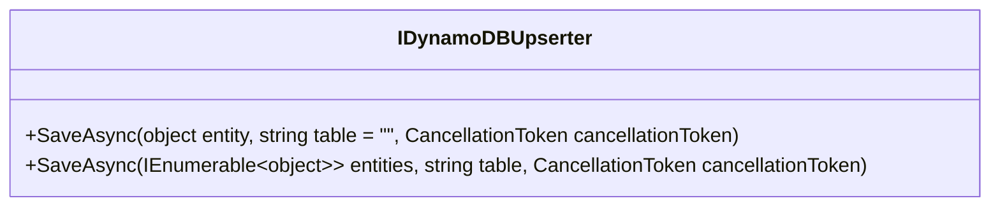

# AWS DynamoDB
## Overview

The AWS DynamoDB component provides both a `from` and a `to` chain allowing you to get the latest changes from a DynamoDB table
as well as persist records to it.

## Chain Links

{: .label .label-red}
FROM

{: .label .label-green }
TO

### From
#### Setup Headers

| Header   | Description                            | Optional | Default   |
|:---------|:---------------------------------------|:---------|:----------|
| Host     | DynamoDB Table Name                    | NO       | EMPTY     |
| PollTime | The amount of time between table scans | YES      | 6 Seconds |

#### Example
```
Kyameru.Route.From("dynamodb://mytable?PollTime=10)"
```

##### PollTime

The `PollTime` attribute is entirely optional and is defaulted to six seconds. When specifying a value, the interval is
in seconds.

### To
#### Headers

| Header   | Description                            | Optional | Default   |
|:---------|:---------------------------------------|:---------|:----------|
| Host     | DynamoDB Table Name                    | NO       | EMPTY     |


#### Example

```
to("dynamodb://mytable")
```

## Important Pre To processing
### Overview

The `To` chain link needs the routable to be of type `IDynamoRecord`. This type is used as the base type for all requests and contains only one required attribute which is the HashKey.
Additionally, you can override the `IDynamoDBUpserter` for Kyameru to implement your own insert and update logic. The interface is
deliberately simple to maximise compatibility with any table.



## Default From Monitoring
The `From` chain link gets records out of the target table by getting the streams and iterating over the shards every (x) seconds. This means that the component will only process new records from the time after the route has been started.
This was chosen because the most likely scenarios did not include wanting to get historical records and to keep things simple.
This of course can be changed with usage and feature requests.