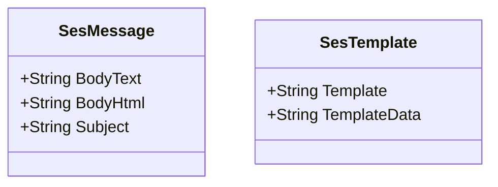

# AWS SES
## Overview

The AWS SES component provides a TO chain link allowing you to send messages to the Simple Email Services.

{: .note }
> The component currently uses V1 of the SES API. V2 will be implemented at a later date and will be available as a header.


## Routes

{: .label .label-red}
FROM

{: .label .label-green }
TO

### TO

#### Setup Headers

|Header | Description | Optional | Default|
|:------ |: ----------- |: -------- |: -------|
|Host | N/A | NO | EMPTY |
|from | Email address messages to come from | YES | EMPTY |

#### Blank Host

Although the required header is the `from` email address, having it as the host would have caused a few parsing issues so it has been kept as a normal header.

##### Example
```
To("ses:///?from=example@example.com")
```

### Message Headers
The large majority of options for the SES message are set through message headers.

|Header | Description | Optional| Default |
|:------ |: ----------- |: --------|: ----------- |
| SESFrom | Email address to send from | YES | Uses `from` in the setup (Setting this will override the setup header) |
| SESTo | Comma separated email addresses | NO | |
| SESBcc | Comma separated email addresses | YES | |
| SESCc | Comma separated email addresses | YES | |

### Message Body

The SES component needs a custom object as the message body. It needs to be either of type `SesMessage` for a standard message or `SesTemplate` for a SES template message.



#### SesMessage

For a message to be valid one of the `BodyText` or `BodyHtml` must be populated and the `Subject` must have a value.

#### SesTemplate

The `Template` is an AWS SES template and the `TemplateData` is expected to be a JSON serialized object with the values for the template.

## Outbound Messages
### TO

The routable message outbound from the component is as follows:

#### Body

No modifications made from inbound message.

#### Headers

|Header | Description | Immutable |
|:------ |: ----------- |: -------- |
| SESId | Id of message sent | YES |

#### Other Headers

All other response attributes from AWS SES will be appended as headers to the outbound routable prefixed with `SES`.

## Notes
### Message Body Classes

It was deemed more appropriate to have the component require a specific object for sending messages / templates. Having everything specified in headers would have meant making the URI too lengthy and possibly hard to understand in code. It seemed more reasonable to specify a message body type and then allow the user to create this in a Processing component or as part of another To components post processing.

```example
.Process((Routable x) => {
    x.SetBody<SesMessage>(new SesMessage() { .. })
})

.To(component, (Routable x) => {
    x.SetBody<SesMessage>(new SesMessage() { .. })
})

```