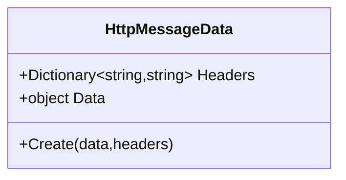

# Overview

The Rest component sends standard HTTP requests to a given endpoint.

{: .note}
> HTTP Authorisation has a basic implementation but you can configure your own.

## Chain Links

{: .label .label-green}
FROM

{: .label .label-green}
TO

{: .label .label-yellow}
Eventbus

### General Conventions

Unless otherwise stated, all requests will be HTTPS. You can specify in the component uri that the request be done via HTTP but that has to be an explicit choice.

### General Format

The URI for this component follows the Kyameru standard as well as HTTP. In other words the constuction for posting a request to `localhost:3000` would be

```
rest://localhost:3000
```

Additional headers to add come in the form of query parameters. Kyameru will strip the query parameters required for the framework out of the eventual URL sent.

### Additional Headers

The below are additional headers that are optional when constructing both the `TO` and `FROM` routes.

| Header | Description                                               | Optional | Default |
|--------|-----------------------------------------------------------|----------|---------|
| https  | Sets whether the request should be sent via http or https | Yes      | true    |
| method | Sets the method to use (get, post, delete etc)            | Yes      | GET     |

## Events
### Overview
In order to start a route with a `From` using the rest component, you must setup and use the Kyameru event bus. The exchange and router are automatically added to DI for you and always available.
Every route that is setup has a unique identity and this is used as the routing key for any messages sent into the event bus. You must indicate that your route uses the event bus by using `EventTrigger()`. This allows Kyameru to execute the correct setup for the component and register a queue with the exchange.

### Setup Example

```
var routeId = Kyameru.Route.From("rest://localhost:3000")
.Process(x => x.SetBody("Hello world"))
.To("rest://localhost:3000/submit?method=post)
.EventTrigger()
.Build(services);
```

The `routeId` will be a GUID and this can then be used to send a request into the exchange.

### Message Implementation



### Triggering a Rest based route

Once you have setup a route using Rest as the `From` and you have assigned its identity to a variable, you can send a message to it using the exchange, the identity and the message type it is expecting. Every component exposes a message class that it is expecting.

{: .note}
> The below example assumes you have already added a dependency for the exchange (IKExchange).

```
await exchange.PublishMessageAsync(routeId, HttpMessageData.Create(routable), cancellationToken);
```

## To

The `To` part of the route is the same format as the `From` and will send a request to the specified endpoint.

## Post / Data Notes

If you are intending on posting to an endpoint it is worth noting that the body of the Http post comes from:

### From

The body of the message comes from the event message posted in.

### To

The body of the message comes from the routable and all headers in the message are posted as Http message headers.

### Body Serialization

To control what mechanism is used to serialize the body of the `Routable` or Event message, you need top specify one of the below headers in the message:

| Header          | Value                    | Description                   |
|-----------------|--------------------------|-------------------------------|
| HttpContentType | application/json         | Serialize body as JSON        |
| HttpContentType | application/octet-stream | Serialize body as ByteContent |
| HttpContentType | text/plain               | Serialize body as PlainText   |
| HttpContentType | text/json                | Serialize body as JSON        |


