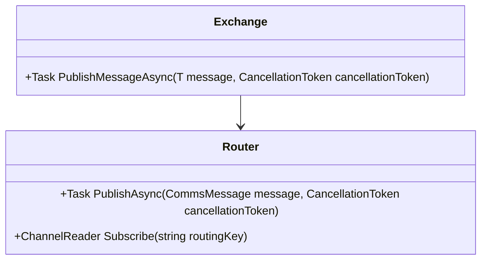

# Overview

During the development of the Rest component, it occurred that this needed some way of being triggered and that a scheduled trigger might not be the best option. Users would need a way of informing the component that it would need to do a request to the specific URI to then follow the rest of the route. Whilst a schedule would suffice it may not be the best decision when it came to functionality in that users will probably not want to schedule a HTTP request every x minutes.

# Considerations

This kind of interaction that is required is very event driven and would lend itself well to a light weight event bus. There is no need for complexities such as a dead letter queue and routing keys for the messages would need to point to specific routes.
I have been playing around with the idea of an exchange for a while. This exchange could allow you to get information about a particular route such as its state, number of executions, failures etc and this information could potentially be pulled into prometheus. The exchange would serve as the entry point and allow you to publish a message into the internal router which would then direct the message to the correct route.

Not every component will have events enabled so adding an additional inflator would probably be required to make sure that components that do not allow for event driven `From` chain links, they are not required to implement the interface.

# Solution

## Overview
And enter [Channels](https://learn.microsoft.com/en-us/dotnet/core/extensions/channels). I won't go over the specifics of this because you can read the documentation yourselves but this seemed to fit the bill perfectly. Asynchronous, thread safe messaging channels that can be embedded into a new chain. The message sent in will be the same (due to primarily how Kyameru is built and constructed) but the data packet in each message will be whatever the component specifies.
Each component will have one or more messages it can use and it is up to the component and chain link to decide how to use it. The whole solution will consist of an `Exchange` which will eventually hold information about every route and a `Router` responsible for sending messages and subscribing to the message bus.

Both the exchange and router will be singletons and the exchange should be used when publishing messages to the message / event bus.

## Initial Steps

For the time being, every route that uses an event will need the user to define and Id so that this becomes the `routing key` and we can send messages to the right route. It would make sense for the message being sent in to have this information in a header but for the time being, for simplicity, we'll stick to explicit routing keys / route ids.

To utilise sending messages from your application or within a route, you need to add a dependency for the `IKExchange` which will allow you to send messages into the internal event bus.

### Naming

As a side note although a sensible suggestion for naming the exchange and router would have been `IExchange` or `IRouter`, we need to make sure it is kept entirely separate from other frameworks. I wanted to avoid using `IKyameruExchange` and the router derivative because it was just too lengthy and decided on `IKExchange` and `IKRouter`.

## Monitoring

Each channel needs to be shutdown or marked as complete when an application shuts down so a Monitoring background service will be created so that when this is stopped, it will trigger a completion of all writer channels to ensure applications do not hang when exiting.