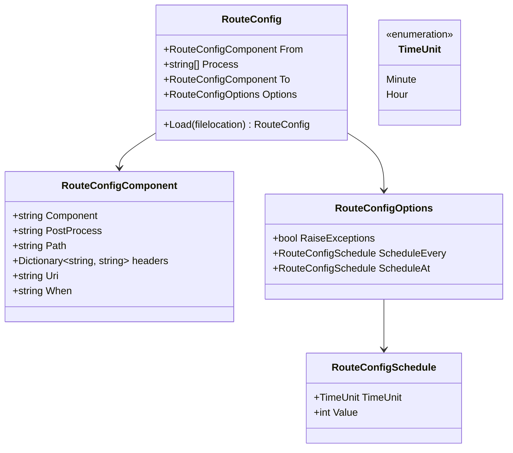

# Getting started with Kyameru
{: .no_toc }
- TOC
{:toc}

## Get Your Components

As each component is reliant on `Kyameru.Core` there is no need to download that separately. Each component has been made as its own distributable so that you only need to get the components you need to use (instead of everything).
Select the components you want from NuGet (pre-release for the latest development versions) and...that's it.

## Creating Your First Route
### Dependency Injection

As Kyameru is dependent on dependency injection (as it uses a background service and a host to run it), you will need to ensure your application host adds an appropriate host. Once this has been added, you can start building a Kyameru Route.

### From

The start of every route is from the `Kyameru.Route` namespace.

```
Kyameru.Route.From()
```

Inside the from part, enter your component URI with its settings and options / headers. For instance, I want to listen into messages on an SQS queue, so I use the AWS SQS component and add it into the from.

```
Kyameru.Route.From("sqs://myqueue")
```

Now there are more options than that (see the SQS component reference) but I have now created my entry point for the route.

### Processing
#### Add a header

This step is entirely optional but after I have pulled the message down, I want to add some additional headers. Kyameru has a built in step for adding headers so I can use that straight after I have pulled the message from SQS.

```
Kyameru.Route.From("sqs://myqueue")
.AddHeader("Test", "Test")
```

Now there are other options for headers, for instance you can use the function delegate to do some more complex processing but that's beyond the scope of this getting started document.

#### Add A Processor

Processors are chain links you build as part of your applications domain. They add any custom logic or processing you need to the routable message before it goes through the to the TO chain links. You can create a processor in many ways:

- Concrete implementation
- Dependency Injection
- Reflection (should only really use with config)
- Action
- Async Function

But for the purpose of this, we'll just use an `Action`.

```
Kyameru.Route.From("sqs://myqueue")
.AddHeader("Test", "Test")
.Process((Routable x) => {
    x.SetHeader("MoreThings", "Test");
})
```
You can do what you like with the routable message and process it how you wish.

### To Route

The To chain link works in the same way as the from. You specify what component you want to route to (with any additional setup headers) and that's it!
The To chain link does have some additional parts to it.

#### Multiple To Routes

You can continue to chain To components together so if you wanted to say put a file in an S3 bucket, sFTP and then archive it, you would chain these three To components together.

#### To Post Processing

Every To chain link has the ability to add post processing to it. This post processing is a `Processor` that you create (the same as an ordinary Processor) and it is executed immediately after the To component has finished.

```
.To("component://setup", new MyProcessor())
.To<IMyProcessor>("component://setup")
.To("component://setup", "MyNamespace.Processor")
.To("Component://setup", (Routable x) => {})
.To("Component://setup", async (Routable x) => {})
```

### Conditional To

Kyameru has the ability to only run a `To` based on a certain condition. A function delegate needs to be specified up front and than the function of the `To` chain link is exactly the same. For example:

```
.When((x => x.Body.ToString == "MyBody"), "component://setup")
.When((x => x.Body.ToString == "MyBody"), "component://setup", PostProcessor)
```

You can also use post processors in the `When` statement as well. The condition has the following signature:

```
Func<Routable, bool>
```

#### Note On Conditional Using Config
When loading routes by config it is important to note that you need to have a concrete class to run the conditional logic. The reason this has been done is to reduce the likelyhood that injected / executable code is introduced by config. In order to create a conditional processor you will need to create a class inside your project and inherit from the interface `IConditionalProcessor`.

```
{
    "From": {
        "Uri": "test://test?TestName=JsonConfigWhenBasic"
    },
    "Process": [
        "Mocks.ConditionalProcessingPass"
    ],
    "To": [
        {
            "When": "ConditionalComponent",
            "Uri": "test://test?RouteCallName=ConfigWhenExecutes_To"
        },
        {
            "Uri": "injectiontest:///mememe"
        }
    ]
}
```

### Id

Every route can be assigned an Id specified by you or it will be assigned at random. To specify an Id, use the Id function. The random Id assigned will be a Guid.

```
.Id("my-route")
```

This may help identify errors if you use several routes.

### Error Route

You can create an error processor `IErrorComponent` that will execute if the route encounters any errors. This gives you an opportunity to do any final processing on a message in the event the route encounters any errors.

### Scheduling

You can schedule a route to execute every (x) minutes, hours or at (x) hour or minute. Full Cron support is not available right now but it will be in future iterations.

```
.ScheduleEvery(Core.Enums.TimeUnit.Minute, 1)

OR

.ScheduleAt(Core.Enums.TimeUnit.Minute, 1)
```

It is important to note that whilst you can ask for something to be scheduled, a component has to be able to support it (FROM part of the component) so ensure you are using a component that can support a schedule.

### Full Example

```
Kyameru.Route.From("sqs://myqueue")
.AddHeader("Test", "Test")
.Process((Routable x) => {
    x.SetHeader("MoreThings", "Test");
})
.Id("my-route")
.To("s3://mybucket/path)
.ScheduleEvery(Core.Enums.TimeUnit.Minute, 1)
.Build(services);
```

>{:note}
Some components `From` chain link will already offer polling (S3, SQS for example) so a schedule will not be necessary.

## Config
Kyameru routes can also be setup through config. You can do this either by specifying a Json file OR by adding a Kyamery section in your appsettings file.

### Config Structure


### Loading Config
As stated before you will need to either load the config by either loading a Json file in or by using appsettings.

#### Loading By File Example
```
Route.FromConfig("location/Of/Json/file.json)
```

#### Loading From AppSettings
```
serviceCollection.Kyameru().FromConfiguration(config);
```

The above assumes you have loaded configuration into a variable called `config`.

### Example Config
#### File Example
```
{
  "From": {
    "Uri": "sqs://myqueue"
  },
  "Process": [
    "MyNamespace.MyProcessor"
  ],
  "To": [
    {
      "Uri": "file:///Users/Me/Somewhere"
    }
  ],
  "Options": null
}
```

#### Appsettings Example
```
{
  "Kyameru": [
    {
      "From": {
        "Uri": "injectiontest:///mememe"
      },
      "Process": [
        "Mocks.MyComponent"
      ],
      "To": [
        {
          "Uri": "injectiontest:///mememe"
        }
      ],
      "Options": null
    }
  ]
}
```

## Summary

And thats it! When your host application starts, the hosted service will start your from route and you can leave Kyameru to it.
To see all the currently available components, go to the [Components](components) section.

## Source

[Show Me The Source](https://github.com/djsuperchief/Kyameru){: .btn .btn-purple }